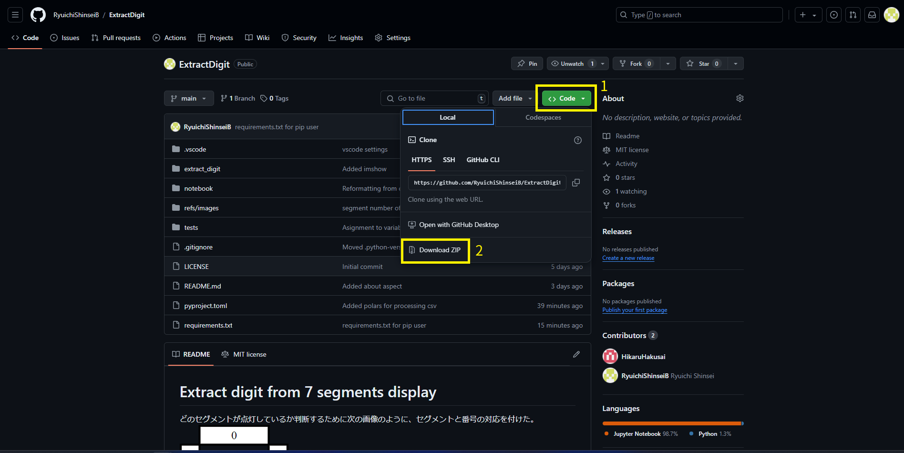
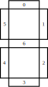

# Extract digit from 7 segments display
## Preparation
### Download
このリポジトリをクローンしてください。
```bash
git clone https://github.com/RyuichiShinseiB/ExtractDigit.git
```
あるいは、ダウンロードしてください



### Requirements package installing
- pip を使っている方はこちらを
```sh
pip install -r requirements.txt
```
- poetry を使っている方はこちらを
```sh
poetry install
```

## Usage
1. 次のコマンドを実行してください。
```sh
python ./extract_digit/main.py
```
2. 次に、画像一枚を対象に解析するか、対象のフォルダ内の全画像を解析するか、あるいは終了するかを選びます。
3. ウィンド画面で解析対象のファイルまたはフォルダを選択します。
    a. フォルダ内全画像の解析を選んだ場合は、続いて保存先のフォルダを選択します。
4. 自動で解析が始まり、検出された数字がコマンドライン上に出力されます。
    a. フォルダ内全画像の解析を選んだ場合は、選んだ保存先に"recognized_digits.csv"というファイルも出力されます。

## Feature
- [ ] Allow shell scripts to execute it.
## Note
どのセグメントが点灯しているか判断するために次の画像のように、セグメントと番号の対応を付けた。


表示部分のアスペクト比は4桁の場合>1.7
